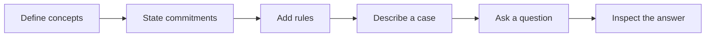

# PFL

**Write a philosophical theory. Give it a case. See what follows, and why.**

PFL (Philosophy Formalization Language) is a small experimental language for
expressing philosophical theories as explicit concepts and rules. It can apply
a theory to a concrete case, answer questions about that case, and trace each
answer back to the commitments that produced it.



## Blog: What and Why

I'm somewhat of a fan of philosophy (and especially an avid fan of the *Philosophize This!* podcast 👀).

Going through the episodes, I found a seemingly re-occuring theme I was particularly interested in.

Again and again, endless philosophers, beginning from Socrates, then progressing with Hume, Kant, Nietzsche, Marcuse, Foucalt and many more, continously critiqued *(although in different ways)* the underlying issue of hidden assumptions.

Nietzsche: **"Convictions are more dangerous enemies of truth than lies."**

It seems to reoccur throughout human logic and philosophy, and to make it worse, the most detrimental assumptions to our own deductions are typically the ones which are most deeply buried.

Although, at the end of the day, our inductive human bias continously pulls in these blatant assumptions - likely to a scale impossible to truly comprehend. I imagine this existing as the difference between Kant's Phenomenal and Noumenal worlds. Not to mention the level of personal variation adding a huge secondary layer of variant complexity, although IMO still not nearly as detrimental to deduction as the most fundamental buried core layer built into us with the very fabric in what it means to be human. Unfortunately, due to our biased assymetric exposure to the differences between one another and the aforementioned depth of the hidden assumptions, we are often unable to even recognize the existence of these assumptions, let alone their impact on our reasoning.

**PFL will never "solve" this problem**, but it will enable clearer and less ambiguous reasoning by **making assumptions explicit**, and by providing a framework to **explore philosophical theories** along with their respective assumptions.

PFL does **not lend truth to a theory**, but rather forces the thinker to **systematize and explicitize** all the necessary groundwork and assumptions that are required to support a theory, and assists in **exploring the implications** of those assumptions.

## A theory in PFL

Here is a small, single-person fragment simplification of preference utilitarianism: between
two available actions, prefer the one that produces the outcome the affected
person prefers.

```pfl
theory MinimalPreferenceUtilitarianism {
    kind Person
    kind Action
    kind Outcome

    posit available_to(action: Action, person: Person)
        reads "{action} is available to {person}"

    posit produces(action: Action, outcome: Outcome)
        reads "{action} produces {outcome}"

    posit prefers(person: Person, better: Outcome, worse: Outcome)
        reads "{person} prefers {better} to {worse}"

    derive better_for(person: Person, better_action: Action, worse_action: Action):
        some better_outcome: Outcome where:
            better_action produces better_outcome
            some worse_outcome: Outcome where:
                worse_action produces worse_outcome
                person prefers better_outcome to worse_outcome

    derive morally_preferred(person: Person, action: Action):
        action is available to person
        some alternative: Action where:
            alternative is available to person
            better_for(person, action, alternative)
}

case MedicineChoice under MinimalPreferenceUtilitarianism {
    let alice: Person
    let take_medicine: Action
    let leave_medicine: Action
    let alice_recovers: Outcome
    let alice_remains_ill: Outcome

    take_medicine is available to alice
    leave_medicine is available to alice

    take_medicine produces alice_recovers
    leave_medicine produces alice_remains_ill
    alice prefers alice_recovers to alice_remains_ill

    ask morally_preferred(alice, take_medicine)
}
```

PFL derives:

```text
ask morally_preferred(alice, take_medicine)
Result: true
```

The theory declares its categories with `kind`, its foundational relations with
`posit`, and sufficient inference rules with `derive`. The case introduces
particular things, supplies facts, and asks what the selected theory implies.

## Why PFL?

- **Make assumptions visible.** Primitive concepts and rules must be declared.
- **Test theories on cases.** Use the same case to explore what a theory implies.
- **Follow the reasoning.** Explanations trace conclusions through their supporting facts and rules.
- **Find structural problems.** Reports flag ambiguity, circular rules, unused declarations, and other semantic debt.
- **Keep formalization readable.** `reads` templates provide controlled, human-friendly statements without pretending to understand unrestricted natural language.

## Use

PFL requires Python 3.13+ and [uv](https://docs.astral.sh/uv/).

```bash
git clone https://github.com/sivakovivan/pfl.git
cd pfl
uv sync

uv run pfl check examples/example_theory.pfl
uv run pfl run examples/example_theory.pfl
uv run pfl explain examples/example_theory.pfl
```

For a larger example with existential reasoning, try:

```bash
uv run pfl explain examples/medicine_case.pfl
```

## Commands

| Command | Purpose |
| --- | --- |
| `pfl check <file>` | Validate a PFL file |
| `pfl run <file>` | Evaluate its cases and questions |
| `pfl explain <file>` | Explain how each result was reached |
| `pfl report <file>` | Inspect concepts, dependencies, and semantic debt |
| `pfl desugar <file>` | Show readable statements in canonical form |

## Current scope

PFL v0.1 is deliberately small and deterministic. It supports typed predicates,
sufficient forward-chaining rules, readable statement templates, and simple
existential witnesses. A query returns `true` when it can be derived and
`unknown` when it cannot; `unknown` does **not** mean false.

PFL does not yet support negation, competing arguments, defeasible rules,
probabilities, or countermodel generation. It is best understood as an
experiment in making small philosophical theories explicit and executable—not
as a replacement for philosophical argument or a general-purpose proof assistant.

See the [language notes](docs/language.md) for the complete v0.1 syntax and
[examples](examples/) for working theories.

## Development

```bash
uv run pytest
```
